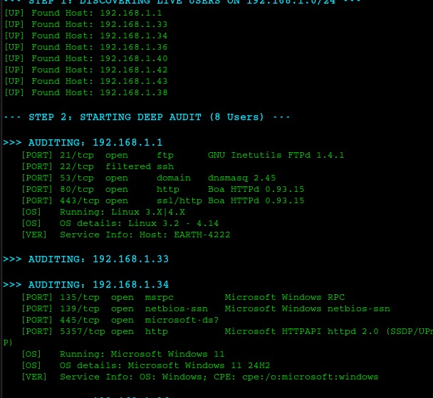
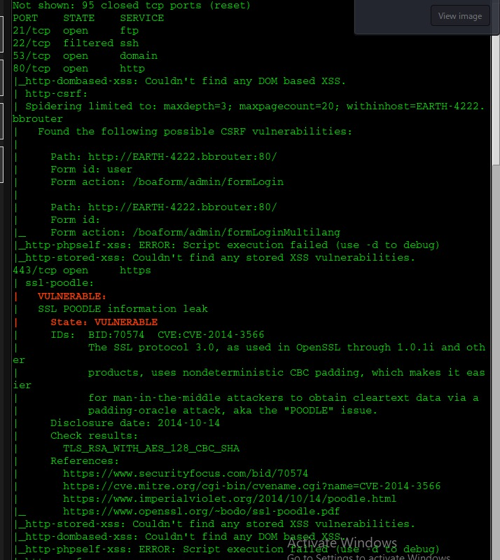
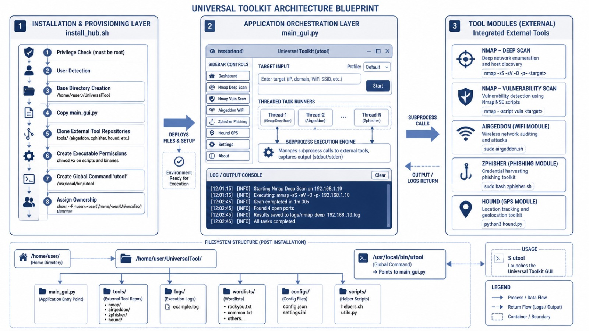

<div align="center">

# 🛡️ Universal Security Hub  
### *Cybersecurity Toolkit for Ethical Hacking & Threat Analysis*

---

[](ca://s?q=Python_Tkinter_GUI_Framework)
[](ca://s?q=Python_threading_for_concurrency)
[](ca://s?q=Python_subprocess_Popen)
[](ca://s?q=Nmap_network_scanning)
[](ca://s?q=Nmap_Scripting_Engine)
[](ca://s?q=Zphisher_phishing_tool)
[](ca://s?q=Ngrok_vs_Cloudflare_tunneling)
[](ca://s?q=Airgeddon_WiFi_auditing)
[](ca://s?q=Hound_GPS_recon_tool)
[](ca://s?q=Qterminal_terminal_emulator)
[](ca://s?q=Bash_shell_scripting)
[](ca://s?q=Git_and_GitHub_version_control)
[-557C94?style=for-the-badge&logo=linux&logoColor=white)](ca://s?q=Kali_Linux_platform)
[](ca://s?q=Virtual_Machine_support)
[](docs/CONTRIBUTING.md)
[]()


<br/>

> A unified, GUI-driven academic security platform built on **Kali Linux**.  
> Consolidates **Network Reconnaissance**, **Phishing Awareness**, **WiFi Auditing**,  
> and **GPS/Identity Recon** into a single multi-threaded Python dashboard —  
> built for ethical cybersecurity training under the OWASP WSTG framework.

<br/>

**[📖 Docs](docs/usage.md)** &nbsp;·&nbsp;
**[🐛 Report Bug](https://github.com/vikashkumarjha-in/Universal-Security-Hub/issues)** &nbsp;·&nbsp;
**[🤝 Contribute](docs/CONTRIBUTING.md)**

</div>

---

## 📑 Table of Contents

- [📸 Screenshots](#-screenshots)
- [🏗️ System Architecture](#️-system-architecture)
- [✨ What It Does](#-what-it-does)
- [🧰 Tech Stack](#-tech-stack)
- [📦 Core Dependencies](#-core-dependencies)
- [📂 Project Structure](#-project-structure)
- [🚀 Quick Start](#-quick-start)
- [⚙️ Installation](#️-installation)
- [💻 Usage](#-usage)
  - [Launching the Hub](#1-launching-the-hub)
  - [Network Deep Scan — Nmap](#2-network-deep-scan--nmap)
  - [Vulnerability Scan — NSE](#3-vulnerability-scan--nse)
  - [WiFi Auditing — Airgeddon](#4-wifi-auditing--airgeddon)
  - [Phishing Awareness — Zphisher](#5-phishing-awareness--zphisher)
  - [GPS & Identity Recon — Hound](#6-gps--identity-recon--hound)
- [🤝 Contributing](#-contributing)
- [⚖️ Disclaimer](#️-disclaimer)
- [📬 Contact & Support](#-contact--support)
- [🔗 Credits & References](#-credits--references)
- [📄 License](#-license)

---

## 📸 Screenshots

<div align="center">

| GUI Dashboard | Live Scan Output |
|:---:|:---:|
|  |  |
| *Command Center sidebar with module buttons* | *Real-time Nmap output in the Command Center* |

| Vulnerability Report | Hound GPS Capture |
|:---:|:---:|
|  |  |
| *NSE vulnerability findings highlighted in red* | *GPS coordinates captured via Hound beacon* |

</div>

---

## 🏗️ System Architecture

<div align="center">




</div>

The Hub follows a **three-tier operational wrapper** architecture:

```
┌─────────────────────────────────────────────────────────────────────┐
│                        PRESENTATION TIER                            │
│          Python / Tkinter GUI  ·  1000×750px  ·  Dark Theme         │
│   ┌────────────────────┐        ┌───────────────────────────────┐   │
│   │   COMMAND CENTER   │        │     LIVE OUTPUT FEED          │   │
│   │  ┌──────────────┐  │        │  [HEADER] Discovering hosts   │   │
│   │  │ IP Range     │  │        │  [PORT]  80/tcp  open  http   │   │
│   │  │ Input Field  │  │        │  [OS]    Linux 5.x            │   │
│   │  └──────────────┘  │        │  [VULN]  CVE-2021-44228 !!!   │   │
│   │  [ Network Scan  ] │        │  [✅]    Scan Complete       │   │
│   │  [ Vuln Scan     ] │        └───────────────────────────────┘   │
│   │  [ WiFi Crack    ] │                                            │
│   │  [ Phish Center  ] │                                            │
│   │  [ Hound GPS     ] │                                            │
│   └────────────────────┘                                            │
└──────────────────────────┬──────────────────────────────────────────┘
                           │  Button click → daemon Thread spawn
┌──────────────────────────▼──────────────────────────────────────────┐
│                        ENGINE TIER                                  │
│               Python  ·  subprocess  ·  threading                   │
│                                                                     │
│   ┌───────────┐  ┌───────────┐  ┌────────────┐  ┌───────────────┐   │
│   │  Nmap     │  │ Zphisher  │  │ Airgeddon  │  │    Hound      │   │
│   │  Thread   │  │ Launcher  │  │ Launcher   │  │   Launcher    │   │
│   │subprocess │  │qterminal  │  │ qterminal  │  │  qterminal    │   │
│   └─────┬─────┘  └─────┬─────┘  └──────┬─────┘  └──────┬────────┘   │
└─────────┼──────────────┼───────────────┼────────────────┼───────────┘
          │              │               │                │
┌─────────▼──────────────▼───────────────▼────────────────▼───────────┐
│                      EXECUTION TIER                                 │
│              Kali Linux  ·  Native Binaries  ·  stdio streams       │
│                                                                     │
│    nmap (raw sockets)    bash zphisher.sh     bash airgeddon.sh     │
│    NSE vuln scripts      Ngrok / Cloudflare   bash hound.sh         │
│    stdout → GUI          PHP beacon server    qterminal sessions    │
└─────────────────────────────────────────────────────────────────────┘
```

**Key architectural decisions:**

- **Daemon threads** — every scan runs in `threading.Thread(daemon=True)` so closing the GUI terminates all child processes automatically.
- **Smart path resolution** — `os.environ.get('SUDO_USER', getpass.getuser())` ensures the correct home directory even when the script is invoked via `sudo`.
- **Isolated tool windows** — Airgeddon, Zphisher, and Hound each launch inside a `qterminal` subprocess, keeping the main dashboard stable.
- **Tagged output rendering** — `ScrolledText` uses `.tag_config()` to colour-code output: `[HEADER]` lines appear cyan (`#00e5ff`), `VULNERABLE` lines appear red-orange (`#ff3d00`).

---

## ✨ What It Does

The **Universal Security Hub** is an academic security research platform developed as a capstone project for B.Tech CSE (Cyber Security) at Maharishi University of Information Technology, Noida. It consolidates four industry-standard tools into a single guided workflow.

| Problem | Solution |
|---|---|
| Students juggle 4+ separate CLI tools with different syntax | Single GUI dashboard — one window controls everything |
| Raw terminal output is hard to parse during learning | Colour-coded, tagged live output stream |
| Long scans freeze basic UIs | Multi-threaded engine; Tkinter main loop never blocks |
| No audit trail for academic review | Auto-generated session logs in `~/UniversalTool/logs/` |
| Complex setup across multiple machines | Single `install_hub.sh` installs all dependencies and registers `utool` |

---

## 🧰 Tech Stack

| Layer | Technology | Purpose |
|---|---|---|
| **GUI Framework** | Python 3 / Tkinter | Desktop dashboard, scrolled output, dark theme |
| **Concurrency** | `threading` (stdlib) | Non-blocking scan execution |
| **Process Management** | `subprocess.Popen` | Spawn Nmap; launch external tool terminals |
| **Network Scanning** | [Nmap 7.94](https://nmap.org) | Host discovery, port scan, OS detection |
| **NSE Scripting** | Nmap Scripting Engine | Automated vulnerability detection, CVE mapping |
| **Phishing Simulation** | [Zphisher](https://github.com/htr-tech/zphisher) | Cloned login-page hosting, credential capture demo |
| **Tunnelling** | Ngrok / Cloudflare | Expose local PHP server for Zphisher & Hound |
| **WiFi Auditing** | [Airgeddon](https://github.com/v1s1t0r1sh3r3/airgeddon) | Monitor mode, deauth, WPA handshake capture |
| **GPS Recon** | [Hound](https://github.com/techchipnet/hound) | PHP beacon, GPS + browser metadata extraction |
| **Terminal Emulator** | qterminal | Isolated interactive sessions for external tools |
| **Shell Scripting** | Bash | Installation automation (`install_hub.sh`) |
| **Version Control** | Git / GitHub | Feature-branch multi-member collaboration |
| **OS / Platform** | Kali Linux (rolling) | Native support for all security binaries |

---

## 📦 Core Dependencies

### Python Standard Library *(no `pip install` required)*

| Module | Used For |
|---|---|
| `tkinter` | GUI window, widgets, layout |
| `tkinter.scrolledtext` | Real-time scrollable output pane |
| `subprocess` | Spawn Nmap process, launch qterminal |
| `threading` | Daemon threads for non-blocking scans |
| `os` | Path construction, directory existence checks |
| `getpass` | Detect real username even under `sudo` |

### System Binaries *(installed by `install_hub.sh`)*

| Binary | Package | Notes |
|---|---|---|
| `nmap` | `nmap` | 7.94+ required for NSE vuln scripts |
| `python3` | `python3` | 3.10+ |
| `python3-tk` | `python3-tk` | Must match your Python 3 version |
| `git` | `git` | Needed by installer to clone tools |
| `php` | `php` | Required by Hound's PHP beacon server |
| `qterminal` | `qterminal` | Hosts Airgeddon, Zphisher, Hound sessions |
| `wget`, `unzip` | `wget` `unzip` | Cloudflare/Ngrok binary downloads |
| `aircrack-ng` | `aircrack-ng` | Core dependency for Airgeddon |

### Third-Party Tools *(cloned by `install_hub.sh`)*

| Tool | Repository | Installed To |
|---|---|---|
| Zphisher | `github.com/htr-tech/zphisher` | `~/UniversalTool/tools/zphisher/` |
| Airgeddon | `github.com/v1s1t0r1sh3r3/airgeddon` | `~/UniversalTool/tools/airgeddon/` |
| Hound | `github.com/techchipnet/hound` | `~/UniversalTool/tools/hound/` |

> There is no `requirements.txt` — the project uses only the Python standard library.  
> All external tool dependencies are resolved automatically by `install_hub.sh`.

---

## 📂 Project Structure

```
Universal-Security-Hub/                 ← Repository root
│
├── 📄 README.md                        ← This file
├── 📄 LICENSE                          ← MIT License (2026)
├── 🔧 main_gui.py                      ← Core GUI application (Tkinter)
├── 🔧 install_hub.sh                   ← One-shot installer & utool setup
├── 📄 .gitignore                       ← Excludes __pycache__, .vscode, etc.
│
├── 📁 src/                             ← Module development boundaries
│   ├── 📁 nmap/
│   │   └── README.md                   ← Nmap engine integration notes
│   ├── 📁 zphisher/
│   │   └── README.md                   ← Zphisher launcher config notes
│   ├── 📁 airgeddon/
│   │   └── README.md                   ← Airgeddon qterminal hook notes
│   └── 📁 hound/
│       └── README.md                   ← Hound PHP beacon notes
│
├── 📁 docs/                            ← Project documentation
│   ├── CONTRIBUTING.md                 ← Branching, PR, and commit guide
│   ├── installation.md                 ← Detailed setup walkthrough
│   └── usage.md                        ← Full module usage reference
│
├── 📁 examples/                        ← Annotated sample tool outputs
│   ├── 📁 nmap/
│   │   ├── sample_host_scan.txt        ← ARP sweep output sample
│   │   └── sample_vuln_scan.txt        ← NSE vulnerability report sample
│   ├── 📁 airgeddon/
│   │   └── sample_handshake_log.txt    ← WPA handshake capture session log
│   ├── 📁 hound/
│   │   └── sample_gps_output.txt       ← GPS beacon metadata sample
│   └── 📁 zphisher/
│       └── sample_credential_log.txt   ← Simulated credential harvest log
│
└── 📁 assets/                          ← Images for README and docs
    ├── 📁 screenshots/                 ← GUI screenshots
    └── 📁 diagrams/                    ← Architecture diagrams
```

**Runtime directories** *(created by `install_hub.sh` — not tracked by Git):*

```
~/UniversalTool/
├── main_gui.py          ← Copied from repo root by installer
├── tools/
│   ├── zphisher/        ← Cloned: github.com/htr-tech/zphisher
│   ├── airgeddon/       ← Cloned: github.com/v1s1t0r1sh3r3/airgeddon
│   └── hound/           ← Cloned: github.com/techchipnet/hound
├── wordlists/           ← Wordlists for cracking modules (user-provided)
└── logs/                ← Auto-generated session logs
    └── handshakes/      ← WPA .cap files captured by Airgeddon
```

---

## 🚀 Quick Start

```bash
# 1. Clone the repository
git clone https://github.com/vikashkumarjha-in/Universal-Security-Hub.git
cd Universal-Security-Hub

# 2. Run the one-shot installer (requires root)
sudo bash install_hub.sh

# 3. Launch the Hub from any terminal
utool
```

The installer will output:

```
🚀 Starting Universal Hub Installation...
[*] Downloading Modules (Zphisher, Airgeddon, Hound)...
[*] Creating 'utool' system command...
✅ SUCCESS! Type 'utool' to start.
```

---

## ⚙️ Installation

### System Requirements

| Component | Minimum | Recommended |
|---|---|---|
| OS | Kali Linux 2023+ | Kali Linux (latest rolling) |
| CPU | Intel Core i3 | Core i7 / AMD Ryzen 7 |
| RAM | 8 GB | 16 GB |
| Storage | 50 GB free | 256 GB SSD |
| Python | 3.10 | 3.11+ |
| WiFi Adapter | Monitor Mode capable | Atheros AR9271 · Ralink RT3070 |
| Internet | Required for installer | Stable broadband |

### Step-by-Step Setup

**Step 1 — Update your system**

```bash
sudo apt-get update && sudo apt-get upgrade -y
```

**Step 2 — Install system prerequisites**

```bash
sudo apt-get install -y \
    nmap \
    python3 \
    python3-tk \
    git \
    php \
    unzip \
    wget \
    curl \
    aircrack-ng \
    qterminal
```

**Step 3 — Clone the repository**

```bash
git clone https://github.com/vikashkumarjha-in/Universal-Security-Hub.git
cd Universal-Security-Hub
```

**Step 4 — Run the installer**

```bash
sudo bash install_hub.sh
```

> **Why `sudo`?** The installer writes to `/usr/local/bin/utool` and creates
> `~/UniversalTool/`. It uses `$(logname)` to detect your real username and
> restores file ownership to you — no root-owned files in your home directory.

**Step 5 — Verify installation**

```bash
which utool            # → /usr/local/bin/utool
ls ~/UniversalTool/    # → main_gui.py  tools/  wordlists/  logs/
```

---

## 💻 Usage

### 1. Launching the Hub

```bash
utool
# — or directly —
cd ~/UniversalTool && sudo python3 main_gui.py
```

> `sudo` is required because Nmap needs raw socket access for ARP host
> discovery (`-sn -PR`) and OS fingerprinting (`-A`).

Once the GUI opens, enter your **TARGET IP RANGE** in the sidebar
(default: `192.168.1.0/24`), then click any module button.

---

### 2. Network Deep Scan — Nmap

**GUI Button:** `Network Deep Scan`

Runs a two-phase audit: ARP sweep to discover live hosts, then an
aggressive audit against each discovered IP.

```bash
# Phase 1 — Host discovery
sudo nmap -sn -PR 192.168.1.0/24

# Phase 2 — Full audit per host
sudo nmap -A -T4 -Pn --open 192.168.1.105
```

**Sample output** (see [`examples/nmap/sample_host_scan.txt`](examples/nmap/sample_host_scan.txt)):

```
Starting Nmap 7.94 ( https://nmap.org ) at 2026-05-26 21:00 IST
Nmap scan report for 192.168.1.1
Host is up (0.0011s latency).
MAC Address: 00:11:22:33:44:55 (Router/Gateway)

Nmap scan report for 192.168.1.105
Host is up (0.0023s latency).
MAC Address: AA:BB:CC:DD:EE:FF (Target Workstation)

Nmap done: 256 IP addresses (2 hosts up) scanned in 2.15 seconds
```

---

### 3. Vulnerability Scan — NSE

**GUI Button:** `Vulnerability Scan`

Runs Nmap's NSE `vuln` script suite. Lines containing `VULNERABLE` are
highlighted in red-orange in the live output pane.

```bash
sudo nmap --script vuln -T4 -F 192.168.1.105
```

**Sample output** (see [`examples/nmap/sample_vuln_scan.txt`](examples/nmap/sample_vuln_scan.txt)):

```
PORT   STATE SERVICE
80/tcp open  http
|_http-csrf: VULNERABLE (Cross-Site Request Forgery)
443/tcp open  https
|_ssl-poodle: VULNERABLE (SSL POODLE Information Disclosure)

Nmap done: 1 IP address (1 host up) scanned with scripts active.
```

---

### 4. WiFi Auditing — Airgeddon

**GUI Button:** `WiFi Crack`

Spawns a `qterminal` window running `sudo airgeddon`. The main
dashboard stays fully responsive throughout.

```bash
# Manual equivalent
sudo airmon-ng start wlan0     # enable monitor mode
sudo airodump-ng wlan0mon      # discover targets
sudo airgeddon                 # launch interactive tool
```

**Six-stage workflow** (see [`examples/airgeddon/sample_handshake_log.txt`](examples/airgeddon/sample_handshake_log.txt)):

```
Stage 1 → Dependency check (bully, pixiewps)
Stage 2 → Interface discovery — wlan0 / wlan0mon (Atheros AR9271)
Stage 3 → Target recon — BSSID, channel, RSSI (dBm)
Stage 4 → Client identification for deauth targeting
Stage 5 → Deauth broadcast → WPA 4-way handshake capture (.cap)
Stage 6 → Artifact saved to ~/UniversalTool/logs/handshakes/
```

> **Hardware note:** Your WiFi adapter must support **Monitor Mode** and
> **Packet Injection**. Confirmed working: Atheros AR9271, Ralink RT3070.

---

### 5. Phishing Awareness — Zphisher

**GUI Button:** `Phishing Center`

Checks for `~/UniversalTool/tools/zphisher/` then launches `zphisher.sh`
inside a `qterminal` window. The shell stays alive after Zphisher exits
(`exec bash`) for post-capture review.

```bash
# Manual equivalent
cd ~/UniversalTool/tools/zphisher
bash zphisher.sh
```

**Workflow inside Zphisher:**

1. Select a platform template (Facebook, Google, Instagram, etc.)
2. Choose a tunnelling provider — Ngrok or Cloudflare
3. Share the generated link within your authorized lab environment
4. Captured test credentials are logged locally for post-exercise analysis

**Sample session log** (see [`examples/zphisher/sample_credential_log.txt`](examples/zphisher/sample_credential_log.txt)):

```
[+] Simulated Credential Harvesting Session Audit log
[TIMESTAMP] 2026-05-26 21:10:15 IST
[MODULE]    Zphisher - Facebook Login Template
[TARGET IP] 192.168.1.115
[ACCOUNT]   test_user_audit@domain.local
```

> ⚠️ All Zphisher operations target **controlled lab accounts** on an
> isolated network. Captured data is used exclusively for post-session
> security awareness review.

---

### 6. GPS & Identity Recon — Hound

**GUI Button:** `Hound GPS`

Checks for `~/UniversalTool/tools/hound/` then launches `hound.sh` in
a `qterminal` window.

```bash
# Manual equivalent
cd ~/UniversalTool/tools/hound
bash hound.sh
```

When a lab participant visits the Cloudflare-tunnelled beacon link, the
following data is captured:

| Category | Fields |
|---|---|
| 📍 Geographic | Latitude, Longitude → Google Maps link |
| 🌐 Network | Public IP address, ISP |
| 💻 Device | Platform, CPU core count, architecture |
| 🖥️ Browser | User Agent string, browser name |

**Sample output** (see [`examples/hound/sample_gps_output.txt`](examples/hound/sample_gps_output.txt)):

```
[+] Hound Web Beacon Metadata Intercept Logs
--------------------------------------------------
Timestamp:         2026-05-26 21:15:22 IST
Latitude:          28.6280
Longitude:         77.3800
Google Maps Link:  https://maps.google.com/?q=28.6280,77.3800
Public IP:         198.51.100.42
Platform:          Linux x86_64 (6 Cores)
```

---
## ⚖️ Disclaimer

## ⚖️ Ethical & Legal Disclaimer

> **🚨 FOR EDUCATIONAL AND AUTHORIZED RESEARCH USE ONLY**

The **Universal Security Hub** is developed strictly for academic and research purposes. It is designed to serve as a platform for security professionals and students to study attack vectors, threat simulation, and defensive strategies within **isolated, controlled, and sandboxed environments**.

**By using this software, you agree to the following terms:**

* **Authorization:** All reconnaissance, vulnerability assessments, and security testing must be performed **only on systems, networks, and devices you own** or have received **explicit written authorization** to audit.
* **Ethical Constraints:** This tool is strictly **not** intended for use against production systems, third-party networks, or any target without prior legal consent.
* **Liability:** The authors and contributors bear **no responsibility** for any misuse, data loss, unauthorized access, or legal consequences arising from the use or distribution of this software. 

### Legal Compliance
Unauthorized access to computer systems or networks is a serious offense and may violate national and international laws, including but not limited to the **Information Technology Act (India)**, the **Computer Fraud and Abuse Act (CFAA, USA)**, and the **General Data Protection Regulation (GDPR)** where applicable. 

### Framework Alignment
This project is built to align with the **OWASP Web Security Testing Guide (WSTG)**. Users are encouraged to maintain the highest standards of professional conduct and adhere to the principles of responsible disclosure.

*If you are using this tool for security research, always prioritize the integrity and privacy of the systems you are auditing.*
---

## 🤝 Contributing

Contributions are welcome — bug fixes, documentation improvements,
new module integrations, and test coverage all count.

### Contribution Workflow

```bash
# 1. Fork on GitHub
#    → https://github.com/vikashkumarjha-in/Universal-Security-Hub/fork

# 2. Clone your fork
git clone https://github.com/YOUR_USERNAME/Universal-Security-Hub.git
cd Universal-Security-Hub

# 3. Create a feature branch
git checkout -b feature/your-feature-name

# 4. Make changes inside your module's folder only

# 5. Commit using the standard format
git add .
git commit -m "feat(nmap): add stealth SYN scan profile"

# 6. Push and open a Pull Request → main
git push origin feature/your-feature-name
```

### Commit Message Format

```
<type>(<module>): <short imperative description>

Types:
  feat      → New capability or feature
  fix       → Bug fix
  docs      → Documentation only
  refactor  → Code restructure, no behaviour change
  chore     → Repo maintenance

Examples:
  feat(nmap): add stealth SYN scan profile
  fix(zphisher): correct Cloudflare tunnel timeout handling
  docs(hound): update GPS beacon setup instructions
  chore: update .gitignore to exclude .cap files
```

### Standards

- Python code in `src/` must follow **PEP 8** formatting.
- New modules require an update to [`docs/usage.md`](docs/usage.md).
- Do **not** commit `.cap` files, credential logs, or any sensitive data.
- See full guide: [`docs/CONTRIBUTING.md`](docs/CONTRIBUTING.md).

---

---

## 📬 Contact & Support

We welcome feedback, bug reports, and feature requests. Please use the following channels for communication:

| Channel | Details |
| :--- | :--- |
| 🐛 **Bug Reports** | [Open a GitHub Issue](https://github.com/vikashkumarjha-in/Universal-Security-Hub/issues) |
| 💬 **Discussions** | [GitHub Discussions](https://github.com/vikashkumarjha-in/Universal-Security-Hub/discussions) |
| 📧 **Project Support** | Please use GitHub Issues for all project-related inquiries |

### Reporting Guidelines
When filing a bug report, please provide the following details to help us debug the issue efficiently:
* **Operating System:** (e.g., Kali Linux 2026.1)
* **Python Version:** (Run `python3 --version`)
* **Environment:** (e.g., Physical machine, VirtualBox, VMware)
* **Error Logs:** Provide the exact traceback or a screenshot of the issue.

---

> **Note:** This project is maintained as an open-source security initiative. Contributions and constructive feedback are highly encouraged.

---

## 🔗 Credits & References

| Resource | Link |
|---|---|
| Nmap — Network Mapper | https://nmap.org |
| Nmap Scripting Engine Docs | https://nmap.org/nsedoc/ |
| Zphisher by htr-tech | https://github.com/htr-tech/zphisher |
| Airgeddon by v1s1t0r1sh3r3 | https://github.com/v1s1t0r1sh3r3/airgeddon |
| Hound by techchipnet | https://github.com/techchipnet/hound |
| OWASP Web Security Testing Guide | https://owasp.org/www-project-web-security-testing-guide/ |
| Kali Linux | https://www.kali.org/ |
| VirtualBox | https://www.virtualbox.org/ |
| Google Cybersecurity Certificate | https://www.coursera.org/professional-certificates/google-cybersecurity |


---

---

## 📄 License

This project is licensed under the **MIT License** — see [LICENSE](LICENSE) for the full text.

```
MIT License  ·  Copyright (c) 2026  Universal Security Hub Team

Permission is hereby granted, free of charge, to any person obtaining
a copy of this software to use, copy, modify, merge, publish, and
distribute it, subject to the condition that the above copyright notice
and this permission notice appear in all copies.

THE SOFTWARE IS PROVIDED "AS IS", WITHOUT WARRANTY OF ANY KIND.
```

---

<div align="center">

**If this project optimizes your security research workflow, consider providing a repository ⭐ on GitHub!**

*If this project helped you, please consider giving it a ⭐ on GitHub.*

[](https://github.com/vikashkumarjha-in/Universal-Security-Hub)
[](https://github.com/vikashkumarjha-in/Universal-Security-Hub/fork)
[](https://github.com/vikashkumarjha-in/Universal-Security-Hub)

<br/>

*Developed under the OWASP WSTG ethical framework · For authorized lab use only*

</div>
